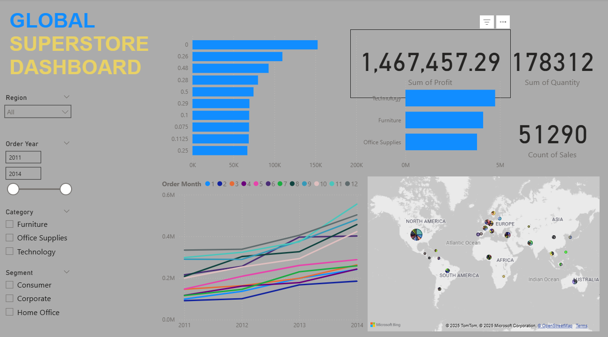

# Global Super Store Dashboard - Power BI

 

## Overview
This Power BI dashboard analyzes sales performance using the [Global Super Store Dataset](https://www.kaggle.com/datasets/juhi1994/global-super-store) from Kaggle. The report visualizes over 51,000 transactions across 24 countries to identify sales trends, regional performance, and product profitability.

## Key Features
- **Sales & Profit Analysis**: Track key metrics across regions and categories
- **Geographic Insights**: Visualize performance by country and region
- **Time Trends**: Analyze sales patterns across years and months
- **Product Performance**: Compare categories and sub-categories
- **Interactive Filters**: Segment data dynamically

## Data Processing
1. **Source**: Global_Superstore2.csv from Kaggle
2. **Transformations**:
   - Fixed date formats (Order Date, Ship Date)
   - Added calculated columns:
     - Shipping Duration (days)
     - Profit Margin (%)
     - Order Year/Month
   - Removed unnecessary columns (Postal Code, Row ID)

## Dashboard Components
| Section | Visuals | Functionality |
|---------|---------|--------------|
| **KPI Summary** | Total Sales, Profit, Quantity, Profit Margin | Quick performance snapshot |
| **Product Analysis** | Sales by Category, Profit by Sub-Category | Compare category performance |
| **Geographic View** | Interactive map with sales bubbles | Identify top-performing regions |
| **Time Trends** | Sales by Year/Month line chart | Track seasonal patterns |
| **Filters** | Segment, Region, Year, Category slicers | Dynamic data segmentation |

## Usage Instructions
1. Download the dataset from [Kaggle](https://www.kaggle.com/datasets/juhi1994/global-super-store)
2. Open `Global_Superstore_Dashboard.pbix` in Power BI
3. Use the slicers to filter data:
   - Select regions (US, APAC, EMEA, etc.)
   - Choose time periods (2012-2015)
   - Filter by customer segment
4. Hover over visuals for detailed tooltips

## Key Insights
1. Technology products generate highest sales and profits
2. APAC region shows strongest growth trend
3. Corporate segment has highest profit margins
4. Shipping duration impacts customer satisfaction
5. Furniture category has lowest profit margins

## Requirements
- Power BI Desktop (latest version)
- Global_Superstore2.csv dataset

[Download Dataset](https://www.kaggle.com/datasets/juhi1994/global-super-store) | 
[Power BI Dashboard](Global_Superstore_Dashboard.pbix)

---

*Replace dashboard_preview.png with your actual screenshot and Global_Superstore_Dashboard.pbix with your Power BI file*
